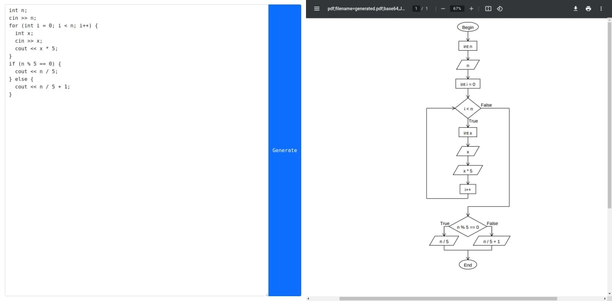

# Flowchart app

Demo app: http://flowchart-app.herokuapp.com/

Site for translating C++-like code to flowcharts. Have an opportunity to create if, loop and one-line expressions using if, else, for, while constructions.

## Available Scripts

In the project directory, you can run:

### `yarn start`

Runs the app in the development mode.\
Open [http://localhost:3000](http://localhost:3000) to view it in the browser.

The page will reload if you make edits.\
You will also see any lint errors in the console.
